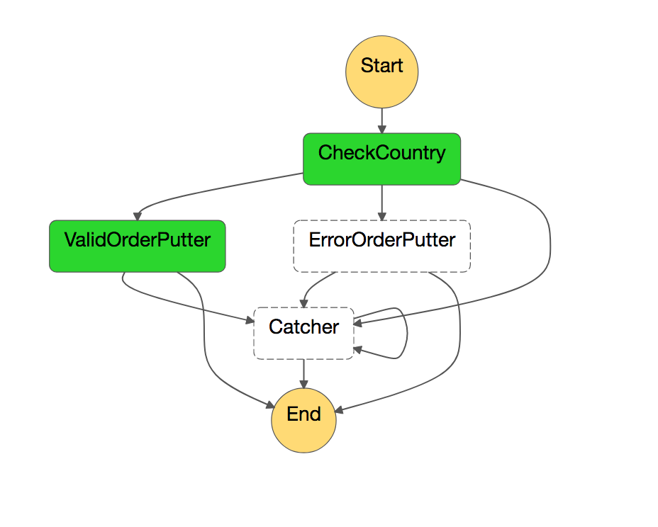
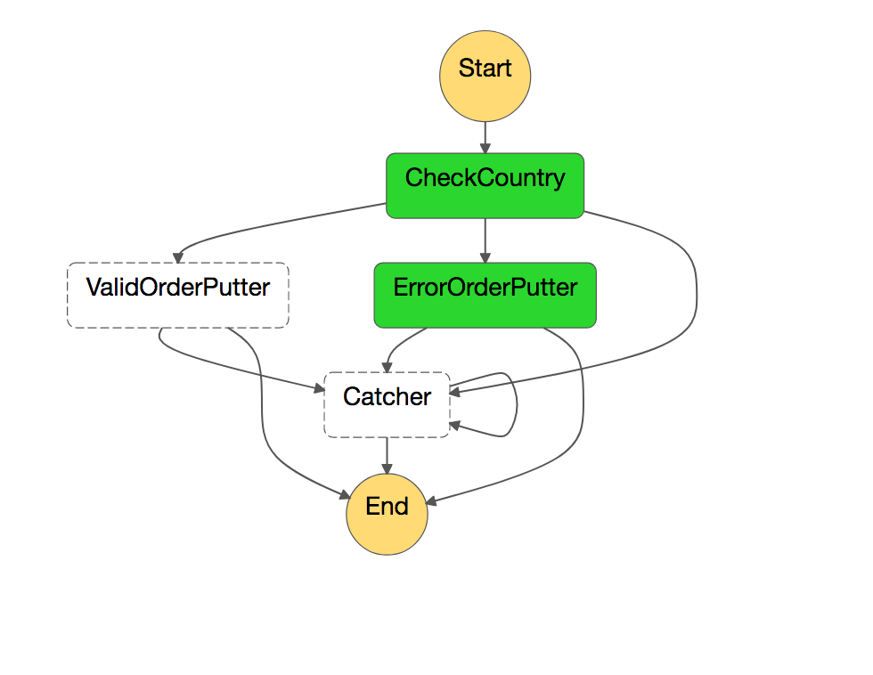
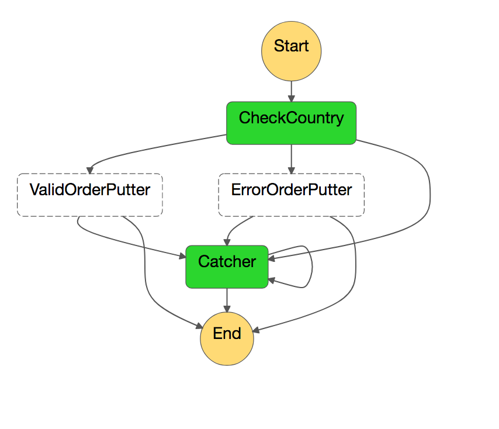

## Pipeline Spike

### Objective

Discover method of improving pipeline performance.

## Constraints

- No data must be lost

## Current Implementation

- lambda reads from kinesis stream.
- invokes step function and then polls execution until complete.
  - on success succeeds.
  - on error retries same order and blocks pipline.

The current implementation ensures that no data is lost as it blocks on error. Although robust, this has proven to be non-performant under load.

## Proposal

- lambda reads from kinesis stream.
- invokes step function.
  - succeeeds if step function invoked without error.
  - errors if step function not invoked successfully.
- step function responsible for putting data back onto stream on error.

This methodology would improve the performance of the pipeline, allowing for higher throughput, while also ensuring no data loss.

The only time that the pipeline will block is if the step function cannot be invoked.

### Implementation

#### AWS States Language

[AWS State Language](https://states-language.net/spec.html) allows errors to be caught in a manner similar to a `catch` block. 

e.g.

```
"CheckCountry" : {
  "Type": "Task",
  "Resource": "${aws_lambda_function.pipeline_spike_check_country.arn}",
  "Next": "ValidOrderPutter",
  "Retry": [
    {
      "ErrorEquals": [
        "States.ALL"
      ],
      "IntervalSeconds": 1,
      "BackoffRate": 2.0,
      "MaxAttempts": 2
    }
  ],
  "Catch": [ 
    {
      "ErrorEquals": [ 
        "ErrInvalidCountryCode"
      ],
      "ResultPath": "$.error",
      "Next": "ErrorOrderPutter"
    },
    {
      "ErrorEquals": [ 
        "States.ALL"
      ],
      "ResultPath": "$.error",
      "Next": "Catcher"
    } 
  ]
}
```

This is taken from the *terraform/step_fn.tf* and demonstrates how errors can be caught and handled using AWS States Language.

Expected errors can be explicitly caught and step function execution can be transitioned to an appropriate state. In the example above, if an erroneous country code is received then execution is transitioned to a lambda that writes to an error bucket.

Unexpected errors can be caught via `States.ALL` error which provides catch all functionality. In the example above unexpected errors will be transitioned to a `Catcher` lambda.

#### Catcher Lambda

The catcher lambda is responsible for putting data back on to the kinesis stream.

In the implementation within this repository a counter gets incremented on the data model whenever an error occurs during it's porcessing. This is then inspected in the invoker to see if it has exceeded the configired maximum attempts. if it has it's written to a bucket which can be alerted on.

```
func Handler(order *models.Order) error {
	order.Attempt++

	orderJSON, err := json.Marshal(order)
	if err != nil {
		return err
	}

	if _, err := kinesisClient.PutRecord(&kinesis.PutRecordInput{
		PartitionKey: aws.String(os.Getenv("PARTITION_KEY")),
		StreamName:   aws.String(os.Getenv("STREAM_NAME")),
		Data:         orderJSON,
	}); err != nil {
		return err
	}

	return nil
}
```

##### Error Handling

To ensure that no data is lost, the catcher lambda must retry indefinitely if an error occurs when putting items back on to the kinesis stream.

This is acheived using recursion. Like the other lambdas in the step funtion, the catch all mehod using `States.ALL` is used.

Prior to this though, to mitigate the potential for a large volume of retries in the event of an error when putting items back on to the kinesis stream, a `Retry` block is utilised.

For `Catcher` retries (before recursively calling itself), the `IntervalSeconds` is set to 2, the `MaxAttempts`is set to 10 and the `BackOffRate` to 2.0.

This would mean that in the event of an error the `Catcher` would retry itself at the following intervals [2^2, 2^3, 2^4, 2^5, 2^6, 2^7, 2^8, 2^9, 2^10] seconds.

After this the process would begin again. In the mean time alerts have been issued and fixes can be put in to allow data to be put back on to the kinesis stream.
 
e.g.

```
"Catcher" : {
  "Type": "Task",
  "Resource": "${aws_lambda_function.pipeline_spike_catcher.arn}",
  "End" : true,
  "Retry": [
    {
      "ErrorEquals": [
        "States.ALL"
      ],
      "IntervalSeconds": 2,
      "BackoffRate": 2.0,
      "MaxAttempts": 10
    }
  ],
  "Catch": [ 
    {
      "ErrorEquals": [ 
        "States.ALL"
      ],
      "ResultPath": "$.error",
      "Next": "Catcher"
    } 
  ]
}
```

Fortunately conditions that would result in an error occuring when putting an item back on to the kinesis stream are limited and are recoverable.

The [Kinesis PutRecord docs](https://docs.aws.amazon.com/kinesis/latest/APIReference/API_PutRecord.html) list the possible errors that can occur when putting an item back on to a kinesis stream.

It's possible to get throtted if the stream's write capacity or KMS read capacity are exceeded but these would self heal.

The other errors are config related, e.g. permissions/(stream|key) deleted, could be fixed via manual intervention.

The only non config/limit error is the `InvalidArgumentException` which would be a real edge case as the data has already been validated as it's been on the stream but a draining mechanism using an environment varialbe could be used to address this rare instance should it occur. :w

The [Step Function docs](https://docs.aws.amazon.com/step-functions/latest/dg/limits.html) state that max step function execution time is one year so you would have this time frame to resolve any issue related to not being to write back to the stream.

##### Example

An example of the pipeline outlined above has been created in this repo.

##### Set Up

- `dep ensure` (install deps - needed to build lambdas)
- `make lambda` (build lambdas - needed to build pipeline)
- `cd terraform && terraform apply` (build pipeline)
- `cd terraform && terraform destroy` (destroy pipeline)

Different behaviour can be observed by putting different data on to the kinesis stream using the [AWS CLI](https://aws.amazon.com/cli).

e.g.

- `aws kinesis put-record --stream-name pipeline_spike_stream --data '{ "id" : "12345", "country_code" : "GB" }' --partition-key test`
  - This triggers the happy path. The JSON will be written to the valid bucket
  
- `aws kinesis put-record --stream-name pipeline_spike_stream --data '{ "id" : "12345", "country_code" : "FR" }' --partition-key test`
  - This triggers the expected error path. The JSON will be written to the error bucket.
  
- `aws kinesis put-record --stream-name pipeline_spike_stream --data '{ "id" : "12345", "country_code" : "PANIC" }' --partition-key test`
  - This triggers the unexpected error path. The item will be retired until it reaches the maximum retries, at which point it will be written to the orphan bucket by the invoker.
  

